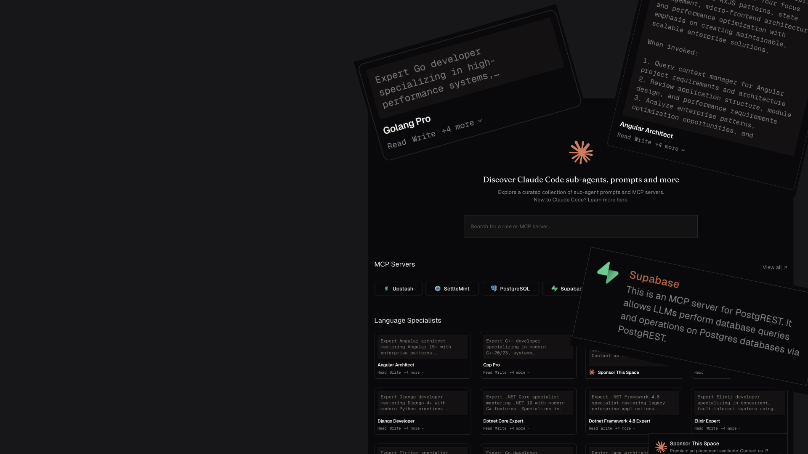

<p align="center">
  
</p>

<h1 align="center">Sub-Agents Directory</h1>

<p align="center">
  Discover Claude Code sub-agents, prompts, and MCP servers.
</p>

<p align="center">
  <a href="#about">About</a> ·
  <a href="#getting-started">Getting Started</a> ·
  <a href="#contributing">Contributing</a> ·
</p>

---

## About

Sub-Agents Directory is a curated collection of **100+ sub-agent prompts** and **MCP servers** for Claude Code. Browse by category, search by keyword, or generate custom agents with AI.

### Features

- **Searchable Directory** — Find the right sub-agent for your task
- **Categorized Prompts** — Language specialists, DevOps, Security, AI/ML, and more
- **MCP Server Registry** — Extend Claude Code with external tools
- **AI Rule Generator** — Create custom sub-agents tailored to your needs
- **One-Click Copy** — Copy prompts directly to your clipboard
- **Open in Claude/ChatGPT** — Use prompts instantly in your favorite AI assistant

## Getting Started

```bash
# Clone the repository
git clone https://github.com/ayush-that/sub-agents.directory.git
cd sub-agents.directory

# Install dependencies
bun install

# Start the development server
bun dev
```

Open [http://localhost:3000](http://localhost:3000) to view the directory.

## Contributing

Content is synced from [VoltAgent/awesome-claude-code-subagents](https://github.com/VoltAgent/awesome-claude-code-subagents). To add a new sub-agent:

### 1. Fork the Upstream Repo

Fork [awesome-claude-code-subagents](https://github.com/VoltAgent/awesome-claude-code-subagents) and clone it locally.

### 2. Create a Rule File

Add a new markdown file in the appropriate category folder:

```
content/
├── 01-core-development/
├── 02-language-specialists/
├── 03-infrastructure/
├── 04-quality-security/
├── 05-data-ai/
├── 07-specialized-domains/
├── 08-business-product/
└── 10-research-analysis/
```

### 3. Define Your Rule

Each rule follows this format:

```markdown
---
name: your-agent-name
description: Brief description of what the agent does
tools: Read, Write, Edit, Bash, Glob, Grep
---

Your agent instructions go here...
```

### 4. Submit a PR

Open a pull request to the upstream repository. Once merged, it will automatically sync to this directory.

## Tech Stack

- **Framework** — [Next.js 16](https://nextjs.org) with App Router
- **Language** — [TypeScript](https://www.typescriptlang.org)
- **Styling** — [Tailwind CSS](https://tailwindcss.com)
- **Components** — [shadcn/ui](https://ui.shadcn.com)
- **Database** — [Supabase](https://supabase.com)
- **Package Manager** — [Bun](https://bun.sh)
- **Linting** — [Oxlint](https://oxc.rs)

## License

MIT
